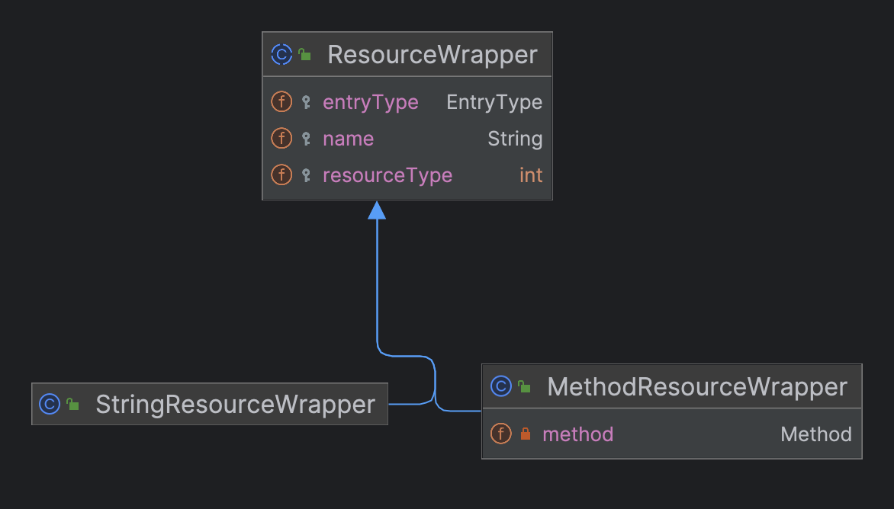
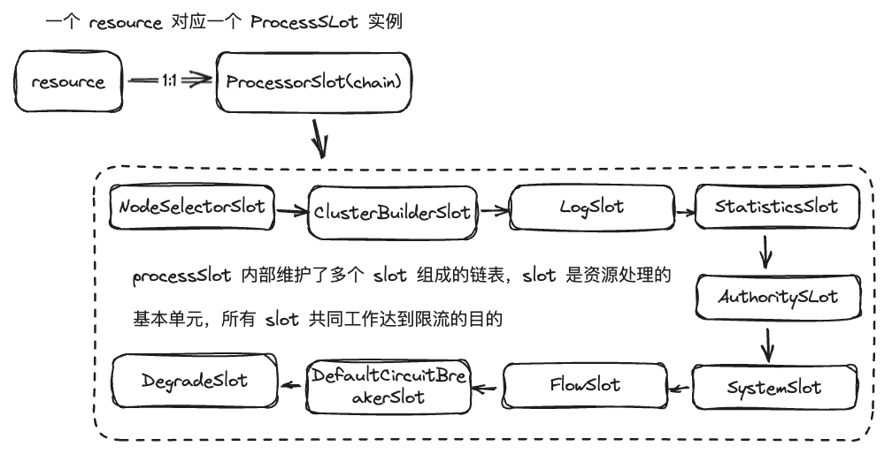
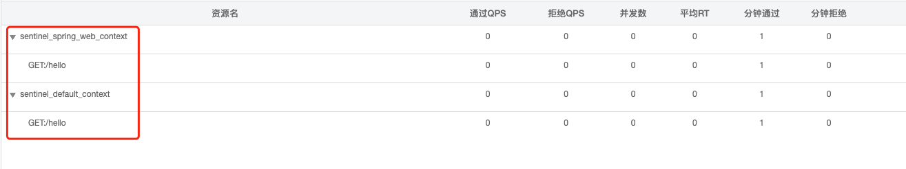
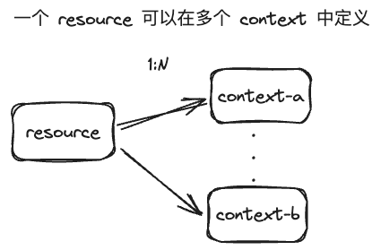
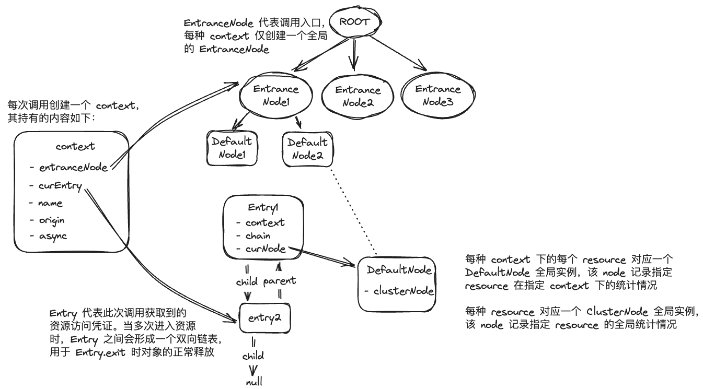
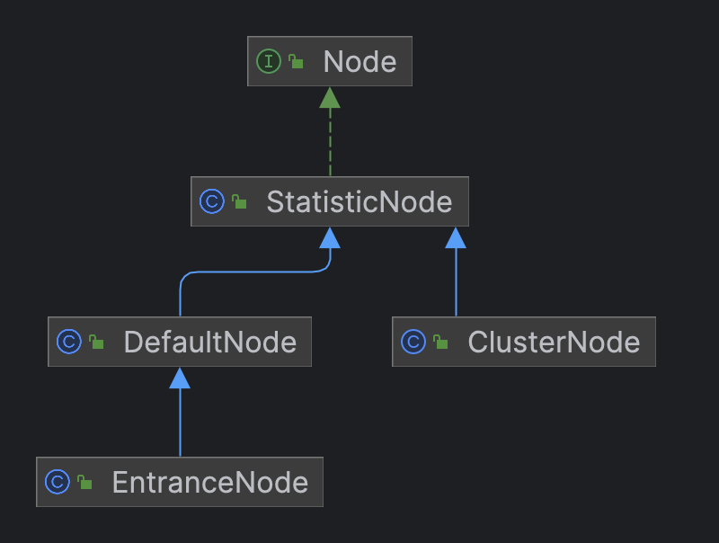

# sentinel 中的几个核心概念

本章我们将正式开始学习 sentinel，在开始之前，我们先了解下 sentinel 中的几个核心概念，方便后续理解相关实现。在 sentinel-core 中有以下几个核心概念：
- resource
- slot
- context
- entry
- node

resource、slot 大概对应着我们实现中的资源和处理链，那 context、entry、node 代表什么呢？
接下来我们就来给大家介绍以上这几种概念。

## Resource
Resource 是 sentinel 中最重要的概念之一，在 sentinel 中对 Resource 定义规则（API 定义或动态数据源写入），检查资源请求流量是否符合定义规则预期
，来保护业务代码或其他临界区资源。资源可以通过以下两种 API 来定义：
1. try-catch 方式（通过 SphU.entry(...)），当 catch 到BlockException时执行异常处理(或fallback)
2. if-else 方式（通过 SphO.entry(...)），当返回 false 时执行异常处理(或fallback)

除了 API 方式之外，从 0.1.1 版本开始，我们还可以通过 @SentinelResource 注解来定义资源。

在 sentinel 中，Resource 的实现有两种：
- StringResource，对字符描述资源的包装实现
- MethodResource，对调用方法的包装实现
  

## Slot
sentinel-core 中对资源限流是通过一个个 slot（槽）来完成的，每种 slot 都有其对应的功能，它们以责任链（slot chain）的模式
共同完成限流操作。slot chain 按照特定的顺序进行编排（如：先统计再检验规则、先校验优先级高的规则），但你也可以提供 SlotChainBuilder 实现来编排 slot chain 顺序。

官方 slot 实现如下（按照调用顺序从上至下展示）：
1. NodeSelectorSlot
2. ClusterBuilderSlot
3. LogSlot
4. StatisticsSlot
5. AuthoritySlot
6. SystemSlot
7. FlowSlot
8. DefaultCircuitBreakerSlot
9. DegradeSlot



## Context
当程序存在较长的调用链路时，随着调用层次越深，相关附加信息就会越多。为了保存这些信息，一般会创建额外的容器来存储，这种类我们一般称之为上下文（Context），
比如 servlet 中的 ServletContext 等。在 sentinel 中每一次调用也有对应的上下文 Context，官方对其描述为：
`This class holds metadata of current invocation`。

其内容保存以下信息：
- name
- entranceNode
- curEntry
- origin
- async

接下来，我们将一一了解各属性的含义。

### name
名称，用于区分不同 context。以 spring mvc 项目接入 sentinel 为例，默认
会有两个 context：sentinel_default_context 和 sentinel_spring_web_context。



resource 可以在多个 context 中重复定义



### entranceNode

entranceNode 代表当前调用链路入口，每种 context（即 name 不同的 context）只创建一个全局唯一的 entranceNode 实例，并作为全局的
 ROOT entranceNode 的子节点。 可以通过 entranceNode 找到当前 context 下的所有 resource 对应的 DefaultNode。

```java
/**
 * 在进入资源时（如下述代码），sentinel 会按照资源进入顺序构建出对应的调用树。
 * 调用树在进入资源时创建，直至程序退出
 *
 *                          Constants.ROOT
 *                              /       \
 *                      child  /         \ child
 *                            /           \
 *              context1.entranceNode     context2.entranceNode
 *                  /        \                      \
 *           child /          \ child                \ child
 *                /            \                      \
 *  resource1 defaultNode   resource2 defaultNode   resource1 defaultNode
 */
public class Demo {
    public static void main(String[] args) {
        ContextUtil.enter("context1");
        try (Entry entry = SphU.entry("resource1")) {
            // do something1 ...
        }
        try (Entry entry = SphU.entry("resource2")) {
            // do something2 ...
        }

        ContextUtil.enter("context2");
        try (Entry entry = SphU.entry("resource1")) {
            // do something1 ...
        }
    }
}
```

### curEntry

entry 代表当前请求访问资源的凭证，当进入多个资源（相同或者不同的资源）时，entry 之间会形成一个双向链表。
```java
/**
 *                           context.curEntry
 *                                  |
 *                                  ↓
 *            +------+ child   +------+
 *            |      | ---->   |      |
 * null <---- |entry1|         |entry2| ------> null
 *     parent |      | <----   |      | child
 *            +------+ parent  +------+
 */
class Demo {
    public static void main(String[] args) {
        // 退出资源和进入资源的顺序相反，先进后出
        try (Entry entry1 = SphU.entry("resource1")) {
            try (Entry entry2 = SphU.entry("resource2")) {
                // do something ...
            }
        } catch (BlockException e) {
            e.printStackTrace();
        }
    }
}
```
当 entry.exit 时，会判断当前 entry 是否还有 parent，如果没有代表 entry 全部退出完毕，这时才会释放 context 对象。

```java
public class CtEntry {
    protected void exitForContext(Context context, int count, Object... args) throws ErrorEntryFreeException {
        if (context != null) {
            // ...
            if (context.getCurEntry() != this) {
                // 进入顺序和退出顺序不一致时的处理逻辑
                // ....
            } else {
                // ....
                context.setCurEntry(parent);
                if (parent != null) {
                    ((CtEntry) parent).child = null;
                }
                // 当 entry 的 parent 为空时，代表是最后一个 entry 退出
                // 此时释放 context 对象
                if (parent == null) {
                    // Default context (auto entered) will be exited automatically.
                    if (ContextUtil.isDefaultContext(context)) {
                        ContextUtil.exit();
                    }
                }
                clearEntryContext();
            }
        }
    }
}
```

### origin

当前Entry的调用来源，通常是调用方的应用名称

### async

是否为异步进入资源


context 中各属性之间的关系示意图如下：



## Node

Node 用于保存资源的实时统计数据，如：passQps、blockQps、rt 等值。

有以下几种 Node，它们之间的继承关系如下：


- 每种 context 下的每种资源对应一个 DefaultNode 实例
- 每种资源对应一个 ClusterNode 实例
- 每种 context 对应一个 EntranceNode 实例

# 总结
在本章，我们了解了 sentinel 中几个核心的概念：
- resource，代表一个被保护的资源，sentinel 通过对资源定义规则来实现限流、熔断等操作
- slot，代表一个处理单元（比如：统计资源访问情况、限流、熔断等操作），sentinel 通过 slot 责任链来实现对资源的限流、熔断等操作
- context，代表当前调用的上下文，记录当前调用的一些附加信息，如：调用链路入口（entranceNode）、凭证（entry）、调用来源等
- entry，代表当前请求访问资源的凭证
- node，用于记录资源实时统计数据，如：passQps、blockQps、rt 等值