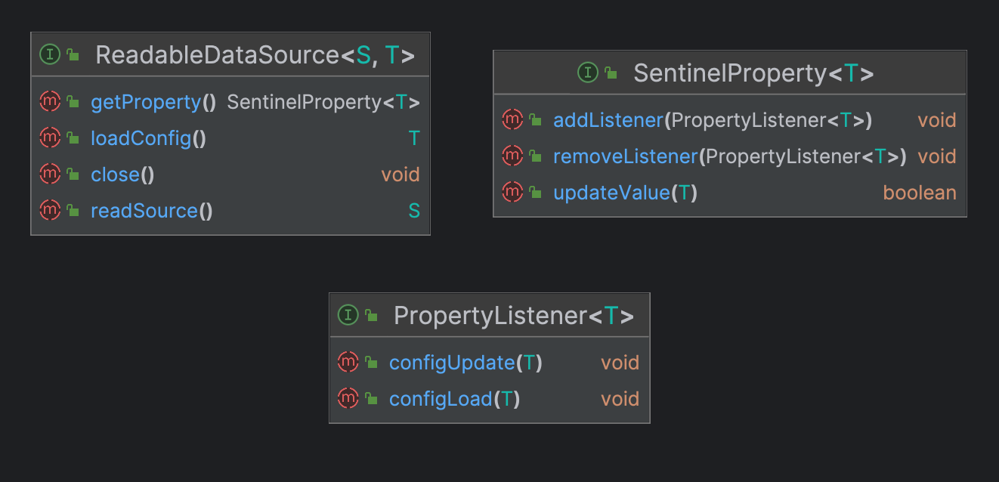
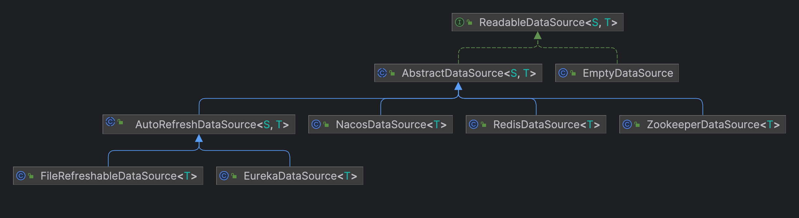

Sentinel 中支持从动态数据源加载规则信息，也支持将规则 API 分组等信息写入动态数据源中。

# 从动态数据源中读取

使用 demo：

```java
// 创建对应组件的可读数据源
// 第四个参数 Function<String, T> 用于将数据源中读取到的文本转换为规则
ReadableDataSource<String, List<FlowRule>> flowRuleDataSource = new ZookeeperDataSource<>(remoteAddress, groupId, flowDataId,  
        source -> JSON.parseObject(source, new TypeReference<List<FlowRule>>() {}));  
// 从数据源中获取 sentinel 相关配置，并且更新到对应的 RuleManager        
FlowRuleManager.register2Property(flowRuleDataSource.getProperty());
```

从上面的使用 demo 可以看到主要涉及到的类有：ReadableDataSource、SentinelProperty、PropertyListener 及其相关 RuleManager。对应的接口定义如下：



结合上述接口定义以及阅读对应代码实现，我们可以了解到 Sentinel 从动态数据源加载规则的流程：
1，RuleManager 通过 ReadableDataSource#getProperty 方法获取 SentinelProperty 实例，同时通过 SentinelProperty#addListener 方法注册监听器，用于监听属性变化，触发对应动作
2，PropertyListener 的 configUpdate 和 configLoad 方法对应属性初次加载和后续变更时的处理。一般为 RuleManager 内部类实现，用于更新对应的规则。如 ParamFlowRuleManager.RulePropertyListener 实现就是在数据源中的规则发生变化时更新应用中的规则
```java
@Override  
public void configUpdate(List<ParamFlowRule> list) {  
    Map<String, List<ParamFlowRule>> rules = aggregateAndPrepareParamRules(list);  
    PARAM_FLOW_RULES.updateRules(rules);
}  
  
@Override  
public void configLoad(List<ParamFlowRule> list) {  
    Map<String, List<ParamFlowRule>> rules = aggregateAndPrepareParamRules(list);  
    PARAM_FLOW_RULES.updateRules(rules); 
}
```
3，ReadableDataSource 通过 readSource 方法从对应的数据源读取原始数据（触发方式有 Pull、Push 两种模式，具体见下文介绍）
4，ReadableDataSource 通过 loadConfig 得到对应转换后的规则数据，并调用 SentinelProperty#updateValue 方法触发下游监听事件

## ReadableDataSource

ReadableDataSource 接口代表动态数据源，可以从其中获取规则数据。根据工作模式大概可以分为两种：Push 模式和 Pull 模式。相关类图如下（该图未展示全部实现类，只列举出典型的几个实现类），下面我们将深入解读相关代码实现。



### Push-based 源码解析

push 模式主要适用于支持发布/订阅的数据源，如 zookeeper 可以订阅节点，在节点发生变化时，执行客户端回调方法。接下来我们就以 ZookeeperDataSource 为例，了解 push 模式的 ReadableDataSource 实现原理：

```java
public ZookeeperDataSource(final String serverAddr, final List<AuthInfo> authInfos, final String groupId, final String dataId,  
                           Converter<String, T> parser) {  
    // ....
    init(serverAddr, authInfos);  
}  
  
private void init(final String serverAddr, final List<AuthInfo> authInfos) {  
	// 注册结点监听器
    initZookeeperListener(serverAddr, authInfos);  
    // 加载初始化规则
    loadInitialConfig();  
}

private void loadInitialConfig() {  
    try {  
	    // 获取节点内容，并通过自定义的 Convert 转换为规则
        T newValue = loadConfig();  
        if (newValue == null) {  
            RecordLog.warn("[ZookeeperDataSource] WARN: initial config is null, you may have to check your data source");  
        }  
        // 更新 SentinelProperty 值
        getProperty().updateValue(newValue);  
    } catch (Exception ex) {  
        RecordLog.warn("[ZookeeperDataSource] Error when loading initial config", ex);  
    }  
}

private void initZookeeperListener(final String serverAddr, final List<AuthInfo> authInfos) {  
    try {  
  
        this.listener = CuratorCacheListener.builder().forNodeCache(() -> {  
            try {  
                T newValue = loadConfig();  
                RecordLog.info("[ZookeeperDataSource] New property value received for ({}, {}): {}",  
                        serverAddr, path, newValue);  
                // Update the new value to the property.  
                getProperty().updateValue(newValue);  
            } catch (Exception ex) {  
                RecordLog.warn("[ZookeeperDataSource] loadConfig exception", ex);  
            }  
        }).build();  
  
        // 创建 zk 连接，并注册监听器
        // ... 
    } catch (Exception e) {  
        RecordLog.warn("[ZookeeperDataSource] Error occurred when initializing Zookeeper data source", e);  
        e.printStackTrace();  
    }  
}
```

### Pull-based 源码解析

pull 模式是适用于无订阅/发布模式的数据源，此时如果想获取较新的数据内容，一般是通过定时拉取的方式实现。故 Pull 模式实现的抽象基类中会启动定时线程，不断拉取最新内容，并且定义了 isModified 方法判断内容是否变化。

```java
public AutoRefreshDataSource(Converter<S, T> configParser, final long recommendRefreshMs) {  
    super(configParser);  
    if (recommendRefreshMs <= 0) {  
        throw new IllegalArgumentException("recommendRefreshMs must > 0, but " + recommendRefreshMs + " get");  
    }  
    this.recommendRefreshMs = recommendRefreshMs;  
    // 启动定时任务拉取新的内容
    startTimerService();  
}  
  
@SuppressWarnings("PMD.ThreadPoolCreationRule")  
private void startTimerService() {  
    service = Executors.newScheduledThreadPool(1,  
        new NamedThreadFactory("sentinel-datasource-auto-refresh-task", true));  
    service.scheduleAtFixedRate(new Runnable() {  
        @Override  
        public void run() {  
            try {  
	            // 只有内容发生变化才加载
                if (!isModified()) {  
                    return;  
                }  
                T newValue = loadConfig();  
                // 更新 SentinelProperty 值
                getProperty().updateValue(newValue);  
            } catch (Throwable e) {  
                RecordLog.info("loadConfig exception", e);  
            }  
        }  
    }, recommendRefreshMs, recommendRefreshMs, TimeUnit.MILLISECONDS);  
}

protected boolean isModified() {  
    return true;  
}
```

仅支持 Pull 模式的数据源有 File、Eureka，我们以 FileRefreshableDataSource 为例进行讲解：

```java
public FileRefreshableDataSource(File file, Converter<String, T> configParser, long recommendRefreshMs, int bufSize,  
                                 Charset charset) throws FileNotFoundException {  
    // 参数验证和赋值 
    // If the file does not exist, the last modified will be 0.  
    this.lastModified = file.lastModified();  
    // 加载初始化规则
    firstLoad();  
}  
  
private void firstLoad() {  
    try {  
        T newValue = loadConfig();  
        getProperty().updateValue(newValue);  
    } catch (Throwable e) {  
        RecordLog.info("loadConfig exception", e);  
    }  
}  

// 此方法实际由定时任务触发
@Override  
public String readSource() throws Exception {  
    if (!file.exists()) {  
        // Will throw FileNotFoundException later.  
        RecordLog.warn(String.format("[FileRefreshableDataSource] File does not exist: %s", file.getAbsolutePath()));  
    }  
    FileInputStream inputStream = null;  
    try {  
        inputStream = new FileInputStream(file);  
        FileChannel channel = inputStream.getChannel();  
        if (channel.size() > buf.length) {  
            throw new IllegalStateException(file.getAbsolutePath() + " file size=" + channel.size()  
                + ", is bigger than bufSize=" + buf.length + ". Can't read");  
        }  
        int len = inputStream.read(buf);  
        return new String(buf, 0, len, charset);  
    } finally {  
        if (inputStream != null) {  
            try {  
                inputStream.close();  
            } catch (Exception ignore) {  
            }  
        }  
    }  
}  
  
@Override  
protected boolean isModified() {  
    long curLastModified = file.lastModified();  
    if (curLastModified != this.lastModified) {  
        this.lastModified = curLastModified;  
        return true;  
    }  
    return false;  
}
```

# 规则写入动态数据源
WritableDataSource
工作机制
UpdateGatewayRuleCommandHandler.setWritableDataSource
静态赋值