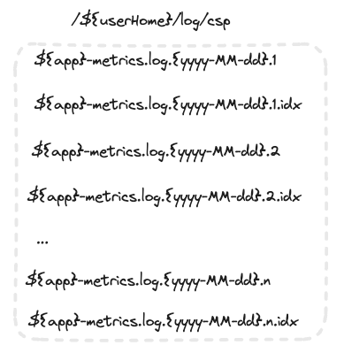
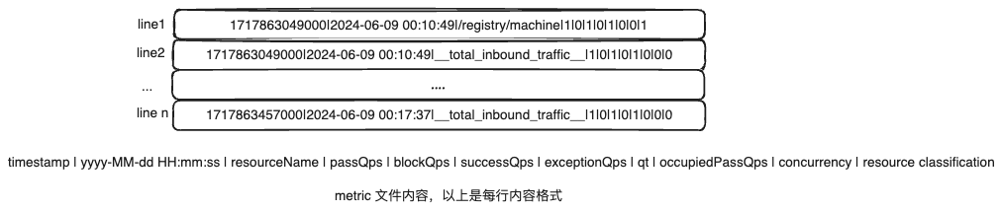
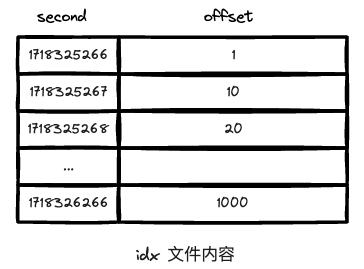
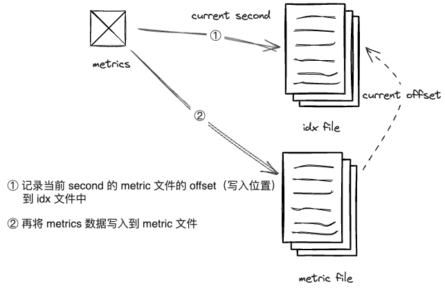
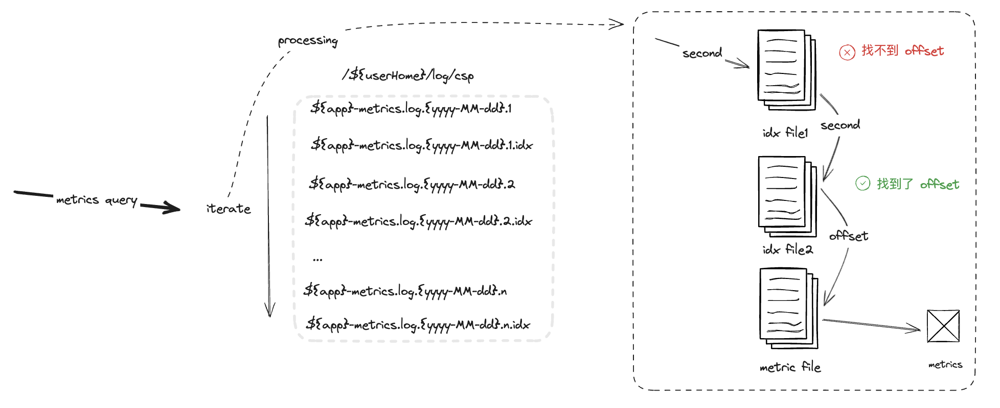

# metrics persistence

sentinel 在运行过程中，会产生大量的统计数据。如果都存储在内存中，会占用大量系统资源，并且会
在应用重启后丢失。

因此 sentinel 会在运行过程由 `MetricTimerListener` 定期将统计数据（metrics）通过 `MetricWriter` 写入到本地磁盘中。

接下来我们将了解 sentinel 中统计数据的具体写入流程以及 sentinel 如何加快统计数据的文件查询。

## write metrics

在开始了解 metrics 的写入流程前，我们先介绍一下 metrics 的文件结构以及内容的组织形式吧。

### file format

sentinel metrics 文件的默认存储于 `${userHome}/log/csp` 目录下。文件命名规则为 `${appName}-metrics.log.${yyyy-MM-dd}.${number}`，
文件通过 appName 进行项目区分，通过日期进行时间区分。文件大小超过上限后（默认 50M）重新创建新的文件，文件名以数字（依次递增）进行区分。

文件类型分为两种：
- 记录实际 metric 数据的文件,我们将其称之为 metrics 文件
- 用于记录 metrics 文件中数据偏移量的文件，我们将其称之为 idx 文件（比 metrics 文件名多一个 .idx 后缀），

每个 metrics 文件对应一个 idx 文件

metrics 文件内部每一行记录一条统计数据，数据格式为：

`timestamp | yyyy-MM-dd HH:mm:ss | resourceName | passQps | blockQps | successQps | exceptionQps | qt | occupiedPassQps | concurrency | resource classification`

idx 文件内部记录了指定时间（单位：秒）对应的 metrics 文件数据的偏移量，比如第 1718325266 秒的 metrics 数据
记录在对应 metrics 文件的 1 位置。

这样看起来 idx 文件有点像是一个简单的索引文件。是的，如果 idx 文件很大的情况下，我们甚至可以再创建一种 .idx.idx 文件类型
用于加速 idx 文件的访问 :)

### writing process

其实从上面的文件设计中我们也就大概了解了 metrics 数据的写入流程了。当发生 metrics 数据写入时：
1. 先将当前时间下 metrics 文件的偏移量记录到 idx 文件中
2. 然后再将 metrics 数据写入到 metrics 文件里

## read metrics

通过上面的介绍，那 metrics 文件的查询逻辑也就不难理解啦。当需要查询指定时间范围内的 metrics 数据时，应该需要先定位
数据对应的位置：
1. 按照顺序（按照文件名中的数字升序顺序）遍历文件夹中的所有 idx 文件，直到找到指定时间对应的数据位置（offset） 
   2. 迭代 idx 文件内容，比对查询时间和记录时间，如果大于记录时间，则查找下一秒的记录。如果整个文件都没有匹配到指定时间的记录，则查询下一个文件
   3. 重复上一步骤，直到查询时间和记录时间一致，返回记录时间对应的偏移量（offset）
4. 从对应的 metrics 文件的指定偏移量（offset）读取数据，反序列化成 metrics 对象进行返回

## conclusion
在本章我们学习了 sentinel 如何写入并查询 metrics 数据的。
其在 metrics 文件之外，维护了一个 idx 文件。用来快速定位指定时间对应的数据位置（偏移量），从而避免迭代所有 metrics 文件，加快了 metrics 数据的查询速度。