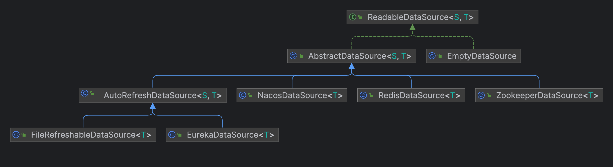

# 规则持久化

Sentinel 中支持从动态数据源加载规则信息，支持推送（Push-based）和拉取（Pull-based）两种模式。

# 读取

###  工作模式：

```java
// 创建对应组件的可读数据源
// 第四个参数 Function<String, T> 用于将数据源中读取到的文本转换为规则
ReadableDataSource<String, List<FlowRule>> flowRuleDataSource = new ZookeeperDataSource<>(remoteAddress, groupId, flowDataId,  
        source -> JSON.parseObject(source, new TypeReference<List<FlowRule>>() {}));  
// 从数据源中获取 sentinel 相关配置，并且更新到对应的 RuleManager        
FlowRuleManager.register2Property(flowRuleDataSource.getProperty());
```

这里涉及到的类有：ReadableDataSource、SentinelProperty、PropertyListener 及其相关实现。其工作原理如下：

ReadableDataSource 通过 Pull 或 Push 的方式获取最新内容，然后更新到 SentinelProperty 中，SentinelProperty 向注册的 PropertyListener 发送通知，PropertyListener 将规则更新到对应的 RuleManager 中。

DataSource 类图


Pull-based 实现源码解析


Push-based 实现源码解析


Property 相关类图

工作原理解析

# 写入
WritableDataSource
工作机制
UpdateGatewayRuleCommandHandler.setWritableDataSource
静态赋值
