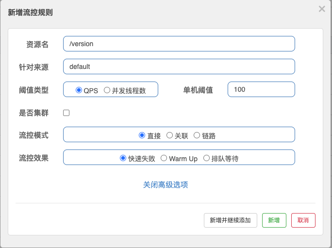

在开始介绍 sentinel 之前，我们或许有点疑问，这玩意儿是啥？有啥用？为啥用它？

官方给出的介绍是：Sentinel 是面向分布式、多语言异构化服务架构的流量治理组件，主要以流量为切入点，从流量路由、流量控制、流量整形、熔断降级、系统自适应过载保护、热点流量防护等多个维度来帮助开发者保障微服务的稳定性。

Soga，原来如此，那我懂了（#其实不是很懂


上面的专业名词多少让人有些疑惑，我们可以通过一个小故事来了解 sentinel 的功能以及应用场景。

## 故事

小明被安排到了一个新的项目组，领导跟他说好好干，以后给他升职加薪。于是小明斗志十足的开始 ~~996~~ 工作，看着日益增长的流量，
小明内心十分欣慰，自己开发的功能终于有人用了。有一天，流量居高不下，小明开心坏了，心想这是要做大做强啊。直到开始服务占用资源飙升，监控预警，系统无响应，最终应用重启，才意识到不对。
通过查看监控发现这些流量集中且来源单一，应该是爬虫。太过分了，你们这些网络扒手，爬就爬吧，竟然不顾我们应用的死活，你给我等着。

小明开始开始在网上搜索如何限流，计数器、滑动窗口、[漏桶](https://en.wikipedia.org/wiki/Leaky_bucket)、[令牌桶](https://en.wikipedia.org/wiki/Token_bucket)等一大堆概念涌过来，倒让小明有点懵。有没有那种现成的，
不用动手开发的解决方案。有，原来 nginx 就支持限流啊，于是小明让运维在 nginx 加上了以下配置：
```
limit_req_zone $binary_remote_addr zone=mylimit:10m rate=10r/s;
 
server {
    location /page1/ {
        limit_req zone=mylimit;
        proxy_pass http://my_upstream;
    }
}
```

过了几天，小明发现流量又升高了起来，原来爬虫开始爬其他接口了。娘希匹，你们这些爬虫没完没了了是吧，要是这样一个一个接口加上去，运维
迟早要干死我。得想个办法，看下市面上有啥成熟的框架没？

不搜不知道，一搜原来还挺多的。Bucket4j、Hystrix、Resilience4j、Sentinel... 那这么多，应该选哪个呢？

那当然选 sentinel 啊，不然怎么继续往下讲。哈哈，开个玩笑，这里每个框架都有自己的侧重点，其与 sentinel 之间的优缺点比对我不在这此赘述了。

按照官网的介绍，我们业务应用接入了 sentinel，连接了 sentinel dashboard，为对应资源（接口）配置一条流控规则，即可对该资源（接口）进行限流。



_是流量限制还是流量整形，取决于配置中的流控效果中的快速失败、排队等待选项_


呼，终于是可以稍微限制住这群爬虫了。但还没开心多久，小明发现服务资源占用还是很高。原来这群爬虫同时请求不同接口，虽然单个接口请求量不高，
但架不住它请求的接口种类多啊。


不行，想办法办他，咽不下这口气。刚好 sentinel 也支持服务级别的限流（也支持不同维度的限制，如 CPU、LOAD、RT、线程数等），赶紧给它加上。


同时，小明也发现了接口的处理能力并不总是一成不变的。当系统空闲时，100 QPS 的速率访问接口都没啥事，但当系统忙碌时，10 QPS 速率访问接口，都响应贼慢。
接口的处理能力受制于系统中各个组件（如：缓存、数据库、消息队列等）的状态，如果当前数据库（单库的情况）正在大批量的更新，那接口大概率也快不起来。
尤其是现在很多框架都有重试的功能，依赖的组件响应慢时，应用重复请求形成重试风暴，会更加加重系统的负载。

当出现接口超时、错误率升高的时候，快速失败或许要比重试、继续等待要更加合理，也能帮助系统更快的恢复。我们可以借助 sentinel 为资源（接口）配置
熔断规则。


最后，小明发现很多爬虫的请求代理都是固定的，能不能对这些来源的请求进行限制？我们可以通过 sentinel 的授权规则对请求进行白/黑名单限制。


这么看来，sentinel 支持的功能挺多的啊。当然，系统的稳定性不可能只靠一种手段来保持住。如果爬虫使用的代理池 ip 很多，即使
每个 ip 请求 100 次，你的系统不崩溃，对外提供的服务能力也会有所降低，所以找出异常的请求（比如访问次数高的 ip 发起的请求）也很重要。
在这方面，sentinel 还很欠缺，我们可以借助 nginx、网关等其他组件去共同完成这个目标。

最终，系统在小明的不断调整下，服务逐渐趋于稳定。不出预料，小明~~就被优化了~~升职加薪了。

# 总结

在本章节，通过一个小故事我们大致了解了 sentinel 的功能以及用途：
- 流量控制规则配置，可以实现限流、流量整形的效果
- 系统规则配置，可以从系统流量、负载、线程数、QPS、CPU 使用率等维度进行限制
- 熔断规则配置，当服务响应慢或异常情况增多，可以对流量进行熔断，减少服务的压力
- 授权规则配置，对请求进行白/黑名单限制
- 热点规则配置，对经常访问的数据进行限制