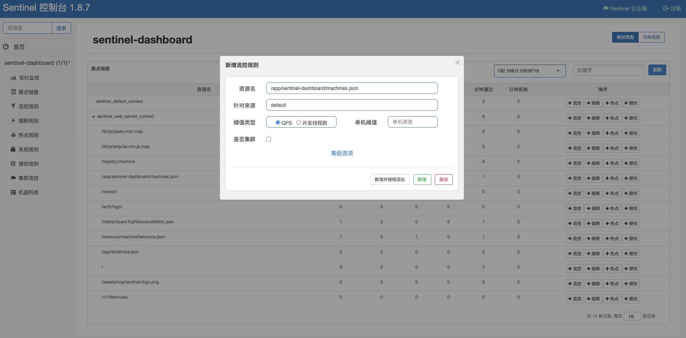
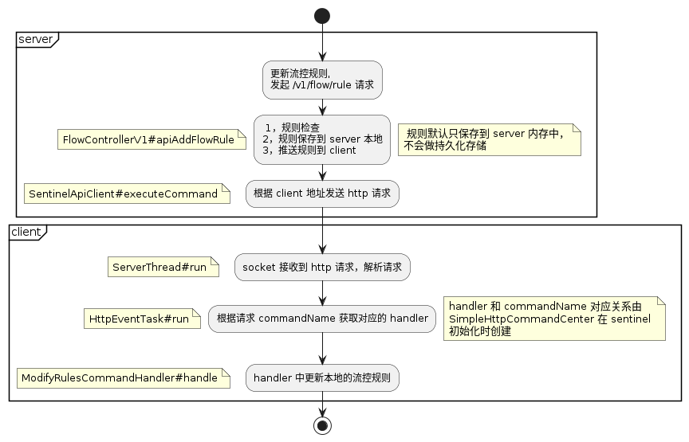

# sentinel dashboard

在上文中，我们学习了如何在应用中集成 sentinel，并定义资源，但我们仍需要为资源定义规则。如果应用运行过程中，发现资源需要被限流，通过代码的方式
定义规则然后发布应用，这个过程费时费力，有没有更加便捷的运维方式呢？

sentinel 提供了单独部署的控制台应用：sentinel dashboard，我们可以通过在浏览器上以图形化的方式对资源规则进行 crud，大大减少了维护的难度。



## transport

我们将单独部署的 sentinel dashboard 称之为 sentinel server，集成 sentinel 的应用称之为 sentinel client。那 server 和 client 之间
怎么通信呢？

server 和 client 之间通过 http 协议进行通信，client 如果想要搭配 server 使用，需要额外引入 sentinel-transport 模块用于通信。

transport 模块的实现有三种：
- 基于 java.net.ServerSocket 实现的 sentinel-transport-simple-http
- 基于 Spring MVC 实现的 sentinel-transport-spring-mvc
- 基于 Netty 实现的 sentinel-transport-netty-http
如无特殊要求，一般使用 sentinel-transport-simple-http 即可，我们下文也以此来介绍 server 和 client 之间的通信原理。

## discovery

在开始开始的之前，我们有个问题，server 是如何发现 client 的呢？

client 启动时需要加入几个 JVM 参数：
- -Dcsp.sentinel.dashboard.server=consoleIp:port  指定控制台地址和端口
- -Dproject.name client 项目名称
- -Dcsp.sentinel.api.port=xxxx   如果一台机器上部署了多个 client，为了防止端口冲突，可以自行指定 client 和 server 通信的端口（选填）

这么一看，貌似是 client 自己将当前机器信息上报给 server 的。那么它是怎么上报的？何时上报的呢？

### heart beat

在 client 中，当进入资源时，sentinel 会触发一系列初始化动作，其中就有 HeartbeatSender 的初始化（在 [sentinel扩展章节](./sentinel-spi.md)有介绍）。
HeartbeatSender 在初始化之后，会定时向 `csp.sentinel.dashboard.server` 地址发送心跳，心跳信息里包含当前机器 ip、port、sentinel 版本等信息。

server 接收到了心跳信息，会将心跳信息中的机器信息添加到列表中，并记录最后一次心跳时间（如果最后心跳时间距今超过 30s，则认为 client 失联）。

### event publish

好了，现在 server 也发现 client 了。那如果我在 server 进行了规则的修改，client 是如何感知到并修改对应的规则呢？

我们通过下面的流程图来介绍规则修改如何通知到 client 的整个过程：


根据上图我们可以看到核心部分就是根据请求的 commandName 找到对应的 handler。

在 sentinel 中先通过 SPI 机制找到所有的 CommandHandler 实现类，然后通过解析类上的 @CommandMapping 注解获取 commandName 和 handler 的对应关系。

```java
@CommandMapping(name = "setRules", desc = "modify the rules, accept param: type={ruleType}&data={ruleJson}")
public class ModifyRulesCommandHandler implements CommandHandler<String> {
    // ...
}
```

## data fetch

如何拉取监控信息
如何拉取链路信息
如何获取规则等信息