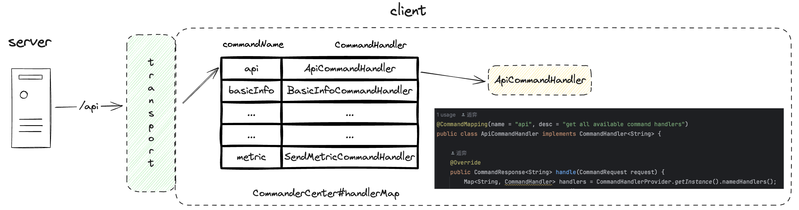
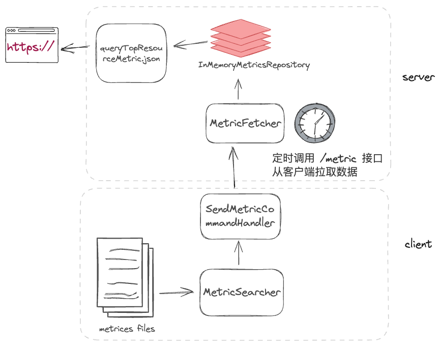
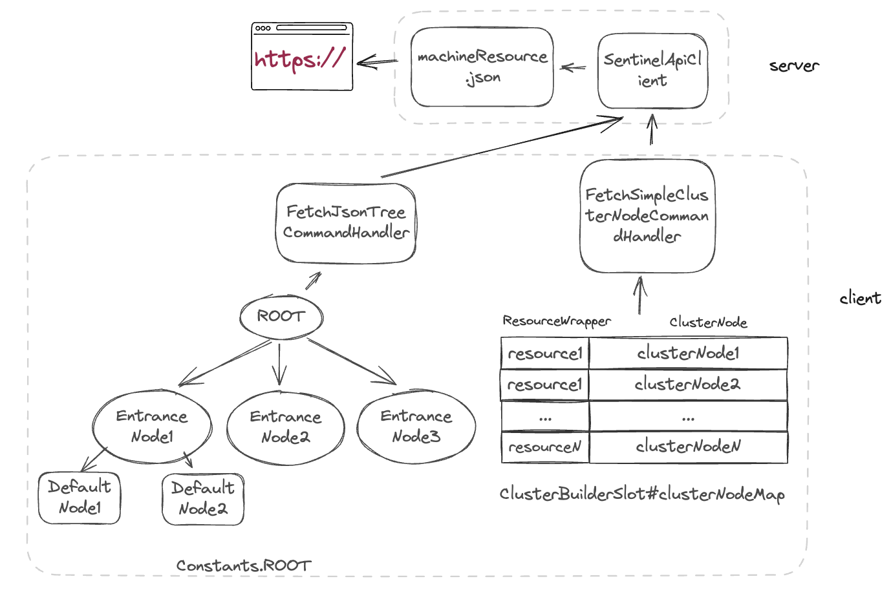
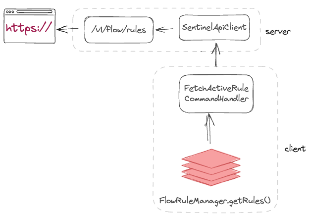

# sentinel dashboard

在上文中，我们学习了如何在应用中集成 sentinel，并定义资源，但我们仍需要为资源定义规则。

在应用日常运行过程中，当发现资源需要被限流，在项目中通过代码定义规则、验证、发布，这个过程费时费力，亟需一种更加便捷的运维工具。

sentinel 中提供了单独部署的控制台应用：sentinel dashboard，使得我们可以在浏览器上以图形化的方式对资源规则进行 crud，大大减少了维护的成本。

## transport

我们将单独部署的 sentinel dashboard 称之为 sentinel server，集成 sentinel 的应用称之为 sentinel client。那 server 和 client 之间怎么通信呢？

server 和 client 之间通过 http 协议进行通信，client 如果想要搭配 server 使用，需要额外在应用中引入 sentinel-transport 模块用于通信。

transport 模块的实现有三种：
- 基于 java.net.ServerSocket 实现的 sentinel-transport-simple-http 模块
- 基于 Spring MVC 实现的 sentinel-transport-spring-mvc 模块
- 基于 Netty 实现的 sentinel-transport-netty-http 模块

如无特殊要求，一般使用 sentinel-transport-simple-http 即可，我们下文也以此来介绍 server 和 client 之间的通信原理。

## discovery

在开始的开始之前，我们有个问题，server 是如何发现 client 的呢？是借助于 zookeeper 进行的服务发现嘛？

倒也没那么复杂，sentinel 没有借助额外的组件来实现服务发现，只需 client 启动时加入几个 JVM 参数：
- -Dcsp.sentinel.dashboard.server=consoleIp:port  指定控制台地址和端口
- -Dproject.name client 项目名称
- -Dcsp.sentinel.api.port=xxxx   如果一台机器上部署了多个 client，为了防止端口冲突，可以自行指定 client 和 server 通信的端口（选填）

这么一看，貌似是 client 自己将当前机器信息上报给 server 的。那么它是怎么上报的？何时上报的呢？

### heart beat

在 client 中，当进入资源时，sentinel 会触发一系列初始化动作，其中就有 HeartbeatSender 的初始化（在 [sentinel扩展章节](./sentinel-spi.md)有介绍）。
HeartbeatSender 在初始化之后，会定时向 `csp.sentinel.dashboard.server` 地址发送心跳，心跳信息里包含当前机器 ip、port、sentinel 版本等信息。

server 接收到了心跳信息，会将心跳信息中的机器信息添加到列表中，并记录最后一次心跳时间（如果最后心跳时间距今超过 30s，则标记 client 失联）。

### event publish

好了，现在 server 也发现 client 了。那如果我在 server 进行了规则的修改，client 是如何感知到并修改当前服务的规则呢？

我们通过下面的流程图来了解规则从浏览器修改到 client 内部规则更新的整个过程：

根据上图我们可以看到核心部分就是根据请求的 commandName 找到对应的 handler。

在 sentinel 中会通过 SPI 机制找到所有的 CommandHandler 实现类，然后通过解析类上的 @CommandMapping 注解获取 commandName 和 handler 的对应关系。

## data fetch

在了解了 server 如何发现 client 以及 server 如何将事件推送到 client 之后。接下来我们来了解下 server 如何主动从 client 中拉取数据的。

在 server 中主动拉取的 client 信息包含以下几种：
- 「实时监控」页面的监控统计信息
- 「簇点链路」页面的调用链路信息
- 各个规则模块的配置规则信息

**监控信息拉取**

1. 浏览器调用 `/metric/queryTopResourceMetric.json` 接口，从 `InMemoryMetricsRepository` 获取 metrics 数据
2. `InMemoryMetricsRepository` 数据由 `MetricFetcher` 定时从 client 中拉取
3. client 内部的 metrics 存储于文件中，通过 `MetricSearcher` 可以按照时间进行检索（metrics 具体写入、查询逻辑见[此章](./metrics-persistence.md)）

### 如何拉取链路信息

1. 浏览器调用 `/resource/machineResource.json` 接口，通过 `SentinelApiClient` 从 client 拉取数据
2. client 从 `Constants.ROOT` 拉取链路信息或从 `ClusterBuilderSlot#clusterNodeMap` 拉取资源

### 如何获取规则等信息

1. 浏览器调用 `/v1/flow/rules` 接口，通过 `SentinelApiClient` 从 client 拉取规则数据
2. client 从对应的 `RuleManager`（如：`FlowRuleManager`）获取规则数据

## conclusion
本章我们学习了 sentinel dashboard(server) 如何发现集成 sentinel 的业务应用(client)，
将规则数据推送到 client 以及从 client 拉取数据。
1. client 通过发送心跳，从而使得 server 发现 client
2. server 在发生规则变更时，会发送事件请求到 client，client 内部通过 commandName 的分发来处理对应的事件
3. server 会以定时、实时的方式通过 http 请求从 client 拉取数据