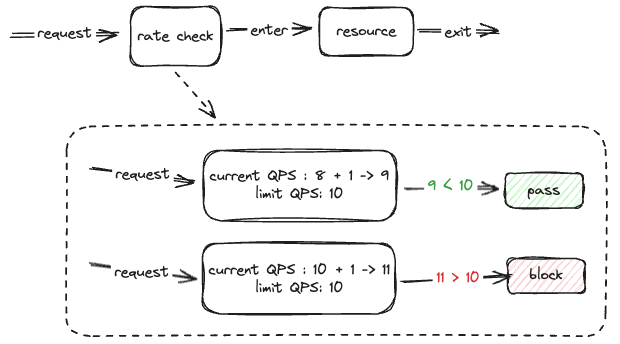
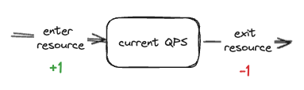
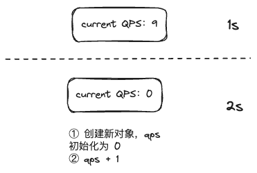
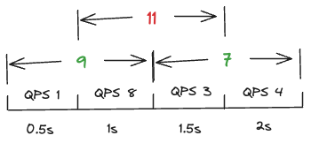
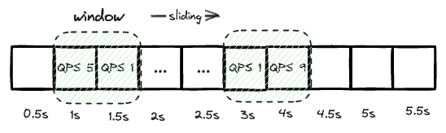
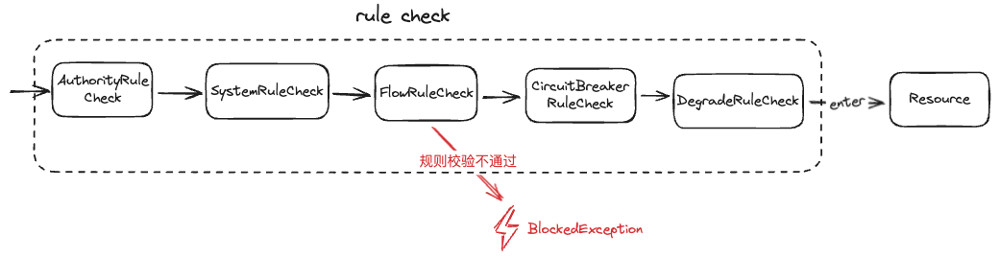
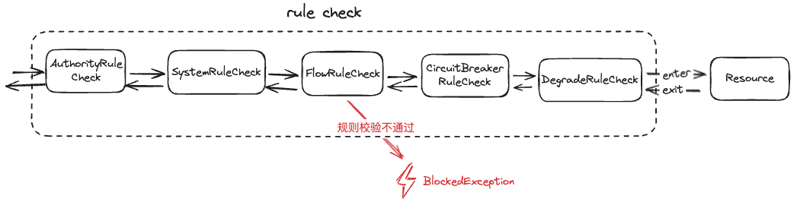

# 自行实现 sentinel

在阅读 sentinel 代码前，我们可以尝试自行实现下 sentinel 的核心功能，这将有助于后续理解 sentinel 的一些概念和实现逻辑。

## QPS 统计

如果要实现限流的功能，那就需要在进入资源临界区之前，比对资源当前的 QPS 和设置的 QPS 上限。如果大于设置的 QPS 上限，则进行
拦截，如果小于则放行。

设置 QPS 上限（limit qps）比较好实现，只要提供一个 API（如：RuleManager.saveRule）用于保存用户设置的值即可。获取资源
当前的访问 QPS 实现则有些棘手，该使用怎样的一个数据结构来统计一秒内的访问次数呢？

最简单的就是创建一个结构体（对象）用于记录资源的最近一秒内访问量，当进入资源时 qps + 1，当退出资源时 qps - 1。

当时间过了一秒，则创建一个新的对象记录下一秒的访问量。

乍看一下没什么问题，我们每秒都能记录一个对应的访问量，并互相隔离。但当我们把时间比例放大，以半秒为一个单位查看的时候，会发现
有可能资源的访问量大于设置的访问上限，这就没有达到限流的效果。究其原因，我们发现是更新的粒度过大导致的，当我们每半秒更新一次，
上述问题就可以被解决。

我们每半秒创建一个新的对象，那每一秒有两个对象，用于记录当前的访问量。这样当前一秒我们称之为时间窗口，其不断向右滑动，舍弃旧的
访问统计数据，维护新的访问数据，达到了比较平滑的统计效果。

（当然我们继续将时间比例放大，还是可能会出现上面的问题，解决方案是继续细化统计粒度。也就是说粒度越小，更新越频繁，统计数据越准确，
同时统计的成本也越高。统计的粒度取决于你对精度和成本的权衡。）

## 规则责任链

上面我们就实现了限流的一个基础，但在 sentinel 中不仅存在流控规则，还有系统规则、授权规则、熔断规则、热点规则等，那应该如何实现呢？

因为进入资源前，需要满足所有规则的检查才可以进入，有一个规则失败则进入资源失败（抛出异常）。这种情况下，使用责任链模式是非常适合的。

但每个规则实现的效果是不一样的。流控规则是为了让进入资源的 QPS 小于定义的 QPS 上线，那我们在进入资源前统计 QPS 并进行规则检查即可。
但熔断规则则是为了在资源发生异常或者响应慢时快速失败，这就要该规则的统计内容（响应异常和 rt 值）发生在退出资源后。

所以我们的责任链不仅在进入资源时执行，还要在退出资源时执行。

当然每个规则的实现并不如上一样：
- 系统规则的检查，需要记录系统全局的 QPS、RT 平均值、CPU 使用率等信息，用于规则的检查
- 授权规则的检查，需要解析请求的来源，比对来源是否在白/黑名单中
- 熔断规则的检查，需要记录资源最近的异常出现频率和 rt 平均值信息，判断是否大于预设的阈值

# 总结
在本章，我们尝试自行实现了 sentinel 的限流功能。我们使用了滑动窗口这个数据结构来统计资源的 QPS 信息（sentinel 中对该数据结构进一步了优化，
后文我们会介绍到），用于限流规则的检查。另外我们还是用了责任链的模式来实现 sentinel 中资源的多规则检查。当然这只是开始，sentinel 中的
实现代码要比上面说的要复杂的多，接下来一章我们来了解下 sentinel 中的一些核心概念。