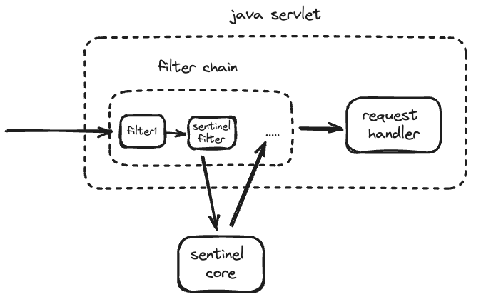

# sentinel-integrated

通过前几章我们了解 sentinel-core 的使用方法和部分实现原理，我们在实际应用中如何使用呢？

在项目中一个个手动定义资源么，那有点繁琐，也不利于长期维护。 在 sentinel 中提供了两种方法，一种我们可以通过注解的方式来定义资源，
另一种是通过 filter 机制拦截所有流量作为资源。

## sentinel aspect

如果项目中引入了 spring-aop，那么在注册 SentinelResourceAspect bean 后，项目中被 @Sentinel 注解修饰过的方法都将被定义为资源。

```java
@Configuration
public class AopConfiguration {
    @Bean
    public SentinelResourceAspect sentinelResourceAspect() {
        return new SentinelResourceAspect();
    }
}

@Aspect
public class SentinelResourceAspect extends AbstractSentinelAspectSupport {

    @Pointcut("@annotation(com.alibaba.csp.sentinel.annotation.SentinelResource)")
    public void sentinelResourceAnnotationPointcut() {
    }

    @Around("sentinelResourceAnnotationPointcut()")
    public Object invokeResourceWithSentinel(ProceedingJoinPoint pjp) throws Throwable {
        Method originMethod = resolveMethod(pjp);

        // 获取方法上的 sentinel 注解定义，转换为资源名
        SentinelResource annotation = originMethod.getAnnotation(SentinelResource.class);
        String resourceName = getResourceName(annotation.value(), originMethod);
        EntryType entryType = annotation.entryType();
        int resourceType = annotation.resourceType();
        Entry entry = null;
        try {
            // 进入资源，成功则进行业务处理，失败则抛出异常
            entry = SphU.entry(resourceName, resourceType, entryType, pjp.getArgs());
            return pjp.proceed();
        } catch (BlockException ex) {
            // 进入资源被拦截时的处理
            return handleBlockException(pjp, annotation, ex);
        } catch (Throwable ex) {
            // ...
            // 其他异常的降级（fallback）处理
            if (exceptionBelongsTo(ex, annotation.exceptionsToTrace())) {
                traceException(ex);
                return handleFallback(pjp, annotation, ex);
            }

            throw ex;
        } finally {
            // 资源的退出
            if (entry != null) {
                entry.exit(1, pjp.getArgs());
            }
        }
    }
}
```

## sentinel adapter 原理

sentinel 中除了使用 aop 机制将 @Sentinel 注解修饰过的方法资源。还可以通过框架提供的 filter、interceptor 等机制将所有流量拦截，全部作为资源
（虽然流量未定义对应的规则，实际上只统计资源访问情况，不做对应的规则检查。但将所有的流量都作为资源，迟早会突破 sentinel 中的资源上限，所以 sentinel 中支持 url 合并，以缩减资源的数量，后文我们将会介绍）。

目前 sentinel adapter 模块支持集成 servlet、spring mvc、dubbo 等 20 种主流框架，对应实现的 adapter 实现原理大同小异。下面我们将以 sentinel-web-servlet 为例，讲解
sentinel 如何和 java servlet 进行集成，其大致示意图如下：



1，引入 sentinel-web-servlet 依赖后
2，在 web.xml 定义 sentinel filter
```xml
<?xml version="1.0" encoding="UTF-8"?>
<web-app xmlns:xsi="https://www.w3.org/2001/XMLSchema-instance" xmlns="https://java.sun.com/xml/ns/javaee" xsi:schemaLocation="https://java.sun.com/xml/ns/javaee https://java.sun.com/xml/ns/javaee/web-app_3_0.xsd" version="3.0">
<filter>
        <filter-name>sentinel-filter</filter-name>
        <filter-class>com.alibaba.csp.sentinel.adapter.servlet.CommonFilter</filter-class>
    </filter>
    <filter-mapping>
        <filter-name>myFilter</filter-name>
        <url-pattern>/</url-pattern>
    </filter-mapping>
</web-app>
```
CommonFilter 中的代码逻辑同 SentinelResourceAspect 类似：
```java
class CommonFilter {
    @Override
    public void doFilter(ServletRequest request, ServletResponse response, FilterChain chain)
            throws IOException, ServletException {
        HttpServletRequest sRequest = (HttpServletRequest) request;
        Entry urlEntry = null;

        try {
            String target = FilterUtil.filterTarget(sRequest);
            // url 合并，返回为 "" 时代表该请求不被 sentinel 处理
            UrlCleaner urlCleaner = WebCallbackManager.getUrlCleaner();
            if (urlCleaner != null) {
                target = urlCleaner.clean(target);
            }

            if (!StringUtil.isEmpty(target)) {
                // 解析请求来源
                String origin = parseOrigin(sRequest);
                String contextName = webContextUnify ? WebServletConfig.WEB_SERVLET_CONTEXT_NAME : target;
                ContextUtil.enter(contextName, origin);

                // 是否将同 url 不同请求方式视为不同资源，如：GET:/foo 和 POST:/foo 是不同资源
                if (httpMethodSpecify) {
                    String pathWithHttpMethod = sRequest.getMethod().toUpperCase() + COLON + target;
                    urlEntry = SphU.entry(pathWithHttpMethod, ResourceTypeConstants.COMMON_WEB, EntryType.IN);
                } else {
                    // 进入资源
                    urlEntry = SphU.entry(target, ResourceTypeConstants.COMMON_WEB, EntryType.IN);
                }
            }
            chain.doFilter(request, response);
        } catch (BlockException e) {
            HttpServletResponse sResponse = (HttpServletResponse) response;
            // Return the block page, or redirect to another URL.
            WebCallbackManager.getUrlBlockHandler().blocked(sRequest, sResponse, e);
        } catch (IOException | ServletException | RuntimeException e2) {
            Tracer.traceEntry(e2, urlEntry);
            throw e2;
        } finally {
            if (urlEntry != null) {
                urlEntry.exit();
            }
            ContextUtil.exit();
        }
    }
}
```
3，创建对应的配置，用于请求来源解析、资源合并和阻塞的处理
```java
class SentinelConfig {
    static {
        initConfig();
    }
    
    public static void initConfig() {
        // 用于将请求 url 进行合并
        // 如：/page/1.html、/page/2.html 合并为 /page/*.html，可以减少资源的个数
        WebCallbackManager.setUrlCleaner(new MyUrlCleaner());
        // 用于解析请求中的来源，用于资源的白、黑名单访问控制
        // 如：解析请求头中的来源 ip，使得部分资源只能被特定来源 ip 访问
        // 当然这个来源不一定时 ip，也可以是 refer、host 等其他请求头或自定义请求头
        WebCallbackManager.setRequestOriginParser(new MyRequestOriginParser());
        // 用于资源访问时被拦截时处理逻辑
        // 如：资源访问受限时，返回 429 响应，使得调用方知道系统当前请求过多
        WebCallbackManager.setUrlBlockHandler(new MyUrlBlcokHandler());
    }
}
```

## 总结

总而言之，sentinel 和我们应用中的框架集成后，要么通过 aop 的机制定义资源，要么通过框架提供的 filter、interceptor 机制拦截请求来定义资源。
这都比较方便的快速将项目中的业务逻辑定义为资源，但我们还需要为资源定义对应的规则，难道我们还是需要手动一个一个定义么？下文我们将介绍如何在 sentinel dashboard 中定义资源规则。