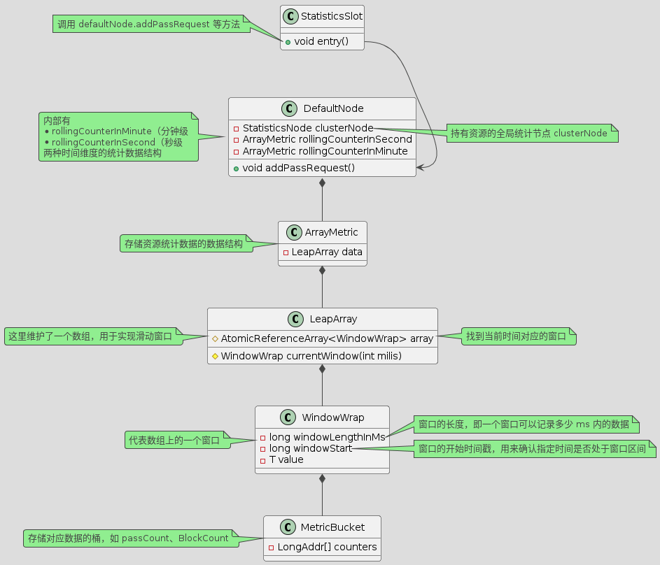
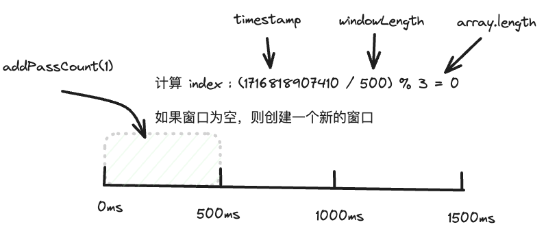
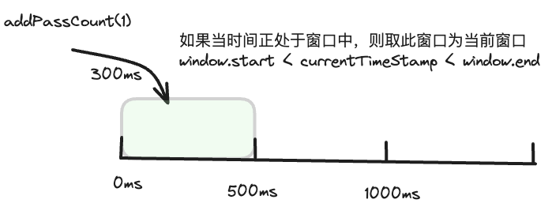
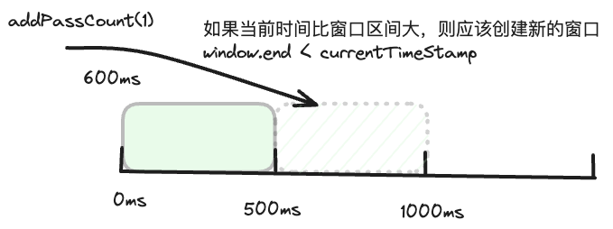
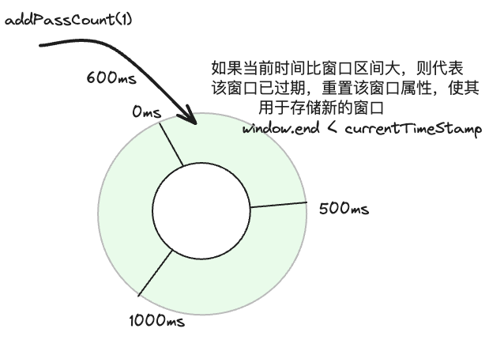

# sliding window

上文介绍了 sentinel 进入、退出资源的大概流程，其中包括了各项规则的检查。规则的检查依赖于当前资源的访问统计数据，那么在 sentinel 中是如何统计资源相关数据的呢？

## 数据统计的 uml 图

在上文，我们了解到数据的统计主要发生在 StatisticsSlot 中，在这个过程中涉及到的类以及调用链路如下图所示：



## 窗口滑动原理和示意图

通过上图我们可以看到，数据统计主要是通过 LeapArray 及其子类实现，其底层数据结构是维护一个滑动数组来记录当前一秒内（或一分钟内）的 passCount、blockCount 等值。

我们以 `ArrayMetric.addPass` 方法为入口，来了解滑动窗口的具体实现逻辑：

```java
class ArrayMetric {
    @Override
    public void addPass(int count) {
        WindowWrap<MetricBucket> wrap = data.currentWindow();
        wrap.value().addPass(count);
    }
}

class LeapArray {
    public WindowWrap<T> currentWindow(long timeMillis) {
        if (timeMillis < 0) {
            return null;
        }

        int idx = calculateTimeIdx(timeMillis);
        // Calculate current bucket start time.
        long windowStart = calculateWindowStart(timeMillis);
        
        /*
         * 通过给定的时间戳获取数组上的窗口
         * 
         * 1，如果窗口为空，则创建一个新的窗口
         * 2，如果窗口是当前窗口，则直接返回当前窗口
         * 3，窗口过期了，则重置窗口作为新窗口
         */
        while (true) {
            WindowWrap<T> old = array.get(idx);
            // 对应索引的窗口为空，则创建新的窗口
            if (old == null) {
                WindowWrap<T> window = new WindowWrap<T>(windowLengthInMs, windowStart, newEmptyBucket(timeMillis));
                if (array.compareAndSet(idx, null, window)) {
                    // Successfully updated, return the created bucket.
                    return window;
                } else {
                    // Contention failed, the thread will yield its time slice to wait for bucket available.
                    Thread.yield();
                }
            } 
            // 当前时间正好在窗口区间内，则该窗口即为当前窗口
            else if (windowStart == old.windowStart()) {
                return old;
            } 
            // 当前时间比窗口时间大，则代表该窗口以及过期
            // 重置该窗口空间，作为新窗口
            else if (windowStart > old.windowStart()) {
                if (updateLock.tryLock()) {
                    try {
                        // Successfully get the update lock, now we reset the bucket.
                        return resetWindowTo(old, windowStart);
                    } finally {
                        updateLock.unlock();
                    }
                } else {
                    // Contention failed, the thread will yield its time slice to wait for bucket available.
                    Thread.yield();
                }
            }
            // 当前时间比窗口时间小，该情况不会出现
            else if (windowStart < old.windowStart()) {
                // Should not go through here, as the provided time is already behind.
                return new WindowWrap<T>(windowLengthInMs, windowStart, newEmptyBucket(timeMillis));
            }
        }
    }
}
```

通过上面的代码以及注释我们可以了解到如何寻找当前窗口以及使得窗口滑动，如果不太清楚也没关系，结合下面的示意图我们来回顾一下上述代码的逻辑：

1，如果当前时间的窗口还未创建，则直接创建一个新的窗口



2，如果当前时间处于窗口区间内，则此窗口即为当前窗口



3.1，如果当前时间比窗口区间大，应该创建的窗口（即在数组右侧的一格空间创建新的窗口）。随着时间的推移，需要不断申请新的数组空间用于存储新的窗口。



3.2，sentinel 在此处进行了优化。由于过期的窗口数据不再被访问，所以我们无需申请新的窗口空间，回收过期的窗口空间用来存储新的窗口。这样在逻辑上形成了一个环形的滑动窗口。



