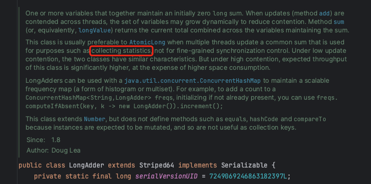
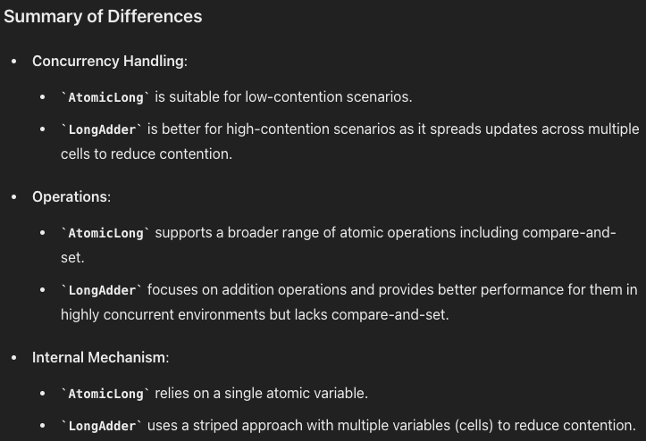

# sliding window

上文介绍了 sentinel 进入、退出资源的大概流程，其中包括了各项规则的检查。规则的检查依赖于当前资源的访问统计数据，那么在 sentinel 中是如何统计资源相关数据的呢？

## 数据统计的 uml 图

在上文，我们了解到数据的统计主要发生在 StatisticsSlot 中，在这个过程中涉及到的类以及调用链路如下图所示：


## 窗口滑动原理和示意图

通过上图我们可以看到，数据统计主要是通过 LeapArray 及其子类实现，其底层数据结构是维护一个滑动数组来记录当前一秒内（或一分钟内）的 passCount、blockCount 等值。

我们以 `ArrayMetric.addPass` 方法为入口，来了解滑动窗口的具体实现逻辑：

```java
class ArrayMetric {
    @Override
    public void addPass(int count) {
        WindowWrap<MetricBucket> wrap = data.currentWindow();
        wrap.value().addPass(count);
    }
}

class LeapArray {
    public WindowWrap<T> currentWindow(long timeMillis) {
        if (timeMillis < 0) {
            return null;
        }

        int idx = calculateTimeIdx(timeMillis);
        // Calculate current bucket start time.
        long windowStart = calculateWindowStart(timeMillis);
        
        /*
         * 通过给定的时间戳获取数组上的窗口
         * 
         * 1，如果窗口为空，则创建一个新的窗口
         * 2，如果窗口是当前窗口，则直接返回当前窗口
         * 3，窗口过期了，则重置窗口作为新窗口
         */
        while (true) {
            WindowWrap<T> old = array.get(idx);
            // 对应索引的窗口为空，则创建新的窗口
            if (old == null) {
                WindowWrap<T> window = new WindowWrap<T>(windowLengthInMs, windowStart, newEmptyBucket(timeMillis));
                if (array.compareAndSet(idx, null, window)) {
                    // Successfully updated, return the created bucket.
                    return window;
                } else {
                    // Contention failed, the thread will yield its time slice to wait for bucket available.
                    Thread.yield();
                }
            } 
            // 当前时间正好在窗口区间内，则该窗口即为当前窗口
            else if (windowStart == old.windowStart()) {
                return old;
            } 
            // 当前时间比窗口时间大，则代表该窗口以及过期
            // 重置该窗口空间，作为新窗口
            else if (windowStart > old.windowStart()) {
                if (updateLock.tryLock()) {
                    try {
                        // Successfully get the update lock, now we reset the bucket.
                        return resetWindowTo(old, windowStart);
                    } finally {
                        updateLock.unlock();
                    }
                } else {
                    // Contention failed, the thread will yield its time slice to wait for bucket available.
                    Thread.yield();
                }
            }
            // 当前时间比窗口时间小，该情况不会出现
            else if (windowStart < old.windowStart()) {
                // Should not go through here, as the provided time is already behind.
                return new WindowWrap<T>(windowLengthInMs, windowStart, newEmptyBucket(timeMillis));
            }
        }
    }
}
```

通过上面的代码以及注释我们可以了解到如何寻找当前窗口以及使得窗口滑动，如果不太清楚也没关系，结合下面的示意图我们来加深对上述代码的理解：

1，如果当前时间的窗口还未创建，则直接创建一个新的窗口


2，如果当前时间处于窗口区间内，则此窗口即为当前窗口


3.1，如果当前时间比窗口区间大，应该创建的窗口（即在数组右侧的一格空间创建新的窗口）。随着时间的推移，需要不断申请新的数组空间用于存储新的窗口。


3.2，sentinel 在此处进行了优化。由于过期的窗口数据不再被访问，所以我们无需申请新的窗口空间，回收过期的窗口空间用来存储新的窗口。这样在逻辑上形成了一个环形的滑动窗口。


## 并发统计的线程安全

获取到当前窗口，我们就可以往窗口写入数据了，那么 sentinel 中是如何保证高并发情况下统计数据的线程安全呢？

```java
class MetricBucket {
    private final LongAdder[] counters;
    
    public void addPass(int n) {
        add(MetricEvent.PASS, n);
    }

    public MetricBucket add(MetricEvent event, long n) {
        counters[event.ordinal()].add(n);
        return this;
    }
}
```

通过上面的 `MetricBucket.addPass` 方法我们可以看到，最终 passCount、blockCount 都存储于 LongAdder 类型的 counters 变量中。这个 LongAdder 是啥东西？它能保证并发时写入的线程安全吗？为啥不用 AtomicLong？

是的，通过阅读 LongAdder 源码的注释，我们会发现此类设计之初就是为了解决并发写入大这种场景的。



通过咨询我们的好朋友 chat-GPT，可以得知其和 AtomicLong 的主要区别如下：



哦，原来 LongAdder 底层有一个 cell 数组用来多线程的分布写入，避免并发写入冲突，这是一个用空间换时间的策略。让我们来浅浅的阅读一下 LongAdder 源码：

```java
public class LongAdder extends Striped64 implements Serializable {
    
    public void add(long x) {
        Cell[] cs; long b, v; int m; Cell c;
        // 尝试更新 base（base 是一个 long 值）
        if ((cs = cells) != null || !casBase(b = base, b + x)) {
            // 获取当前线程的 index，用于更新数组中对应的 cell
            int index = getProbe();
            boolean uncontended = true;
            // 如果更新 base 值失败，则尝试更新 cell
            if (cs == null || (m = cs.length - 1) < 0 ||
                    // cell 为空，或者更新 cell 值未冲突
                    (c = cs[index & m]) == null ||
                    !(uncontended = c.cas(v = c.value, v + x)))
                // 多线程更新 cell 时冲突，尝试更新其他 cell
                // 如果冲突严重，则扩容 cell 数组
                longAccumulate(x, null, uncontended, index);
        }
    }

    public long sum() {
        // 将 base 和 cell 数组中的值进行汇总
        Cell[] cs = cells;
        long sum = base;
        if (cs != null) {
            for (Cell c : cs)
                if (c != null)
                    sum += c.value;
        }
        return sum;
    }
}
```